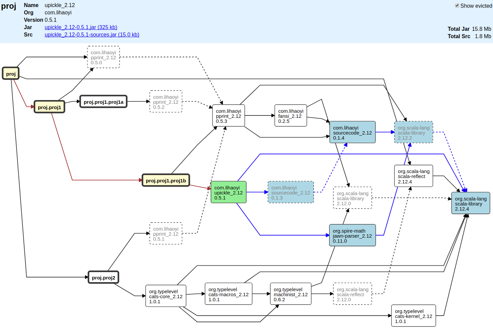

mill-dgraph
===========

**dgraph** is a [mill](https://github.com/lihaoyi/mill) build tool plugin (well, not really, mill doesn't have
proper plugins yet but it's still pretty easy to use). It analyses project artifact dependencies 
(like [sbt-dependency-graph](https://github.com/jrudolph/sbt-dependency-graph)) and presents them in 
graphical form.

It shows how your projects relate and which dependencies they are pulling in. Evictions are also shown but 
can be disabled for a clearer view. You can see sizes of all code and source jars to estimate how big your project is
getting and which dependencies are contributing the most.

Clicking on a dependency shows all it's ancestors and descendants 

The web page part works offline - artifact resolution may want internet access

## Usage 

Mill is under rapid development and it is unlikely that the API will stabilize for a while, this might mean there are 
incompatibilities between the mill version you are using and this 'plugin'. I'll try to keep dgraph up to date with the newest
mill releases.

To use the plugin you need to add the following to your `build.sc` file.

    import $ivy.`com.github.ajrnz::mill-dgraph:0.1`

    val dgraph = plugin.dgraph 
   
The first line loads the library and the second brings it into the local scope for easy access.

You can then run the following from inside the _mill build REPL_ where `proj` is the name of a project (`ScalaModule`). 

    dgraph.browseDeps(proj)()
    
This will open a browser window with a tree like the one above.

If you would like to view the dependencies due to an arbitrary set of dependencies try,

    dgraph.browseDeps(proj, "com.typesafe.play::play:2.6.11")() 
    
Note: that you still need to supply a reference project. Details like the scala version and repositories are extracted
from this project during the resolution process.

The input format for the dependency is fairly lenient. ie all the following are valid:

    dgraph.browseDeps(proj, "com.typesafe.play::play:2.6.11")() 
    dgraph.browseDeps(proj, """ivy"com.typesafe.play::play:2.6.11"""")() 
    dgraph.browseDeps(proj, """"com.typesafe.play" %% "play" % "2.6.11""""")() 
    dgraph.browseDeps(proj, "com.typesafe.play::play:2.6.11", "com.typesafe.akka::akka-http:10.0.11")() 

You can also call it from the command line:

    mill dgraph.browseDeps proj
    
or    

    mill dgraph.browseDeps proj com.typesafe.play::play:2.6.11

### Future

* Currently only looks at runtime dependencies - could look at compile/test
* Text based lists of dependencies / sizes
* Suggestions welcome...
